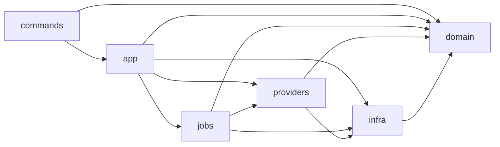

# Rust / Tauri Architecture Instructions

## 目标结构

Rust 后端应逐步收敛为：

```text
src-tauri/src/
├── lib.rs       # Tauri 初始化、state 注入、command 注册
├── main.rs      # Tauri 入口
├── commands/    # Tauri command 薄层
├── app/         # 业务编排服务
├── domain/      # 实体、DTO、状态枚举、错误类型
├── infra/       # SQLite、HTTP、Keychain、音频文件、进程管理
├── providers/   # ASR、Speaker、Semantic provider 实现
└── jobs/        # 后台任务、队列、重试状态机
```

## 依赖方向



约束：

1. `domain/` 不依赖 `commands/`、`app/`、`infra/`、`providers/`、`jobs/`。
2. `commands/` 只做参数校验、调用 app/helper、返回 DTO，不承载长业务流程。
3. `lib.rs` 不继续堆业务逻辑；新逻辑优先落到对应模块。
4. `providers/` 不直接操作 UI 状态。
5. `infra/` 负责外部副作用，例如 SQLite、HTTP、文件、进程、密钥读取。
6. `jobs/` 负责后台任务状态机、重试、失败记录，不把任务状态散落到 command 中。

## Tauri Command 规范

1. command 函数保持薄层，返回结构化 DTO 或明确错误字符串。
2. command 输入不要直接暴露内部数据库模型。
3. 需要共享状态时，通过 `tauri::State<AppState>` 注入。
4. 对用户可见错误使用中文摘要；日志可以包含英文错误类型，但必须脱敏。
5. 新增 command 后同步检查 `tauri::generate_handler!` 注册。

## AppState 与并发

1. 共享状态必须明确互斥边界，避免长时间持有锁跨网络或文件 I/O。
2. 录音控制、任务处理、模型测试等长耗时操作要避免阻塞 UI。
3. 手动刷新、任务重试等操作要有节流或幂等保护。
4. 失败状态必须可追踪，不能只吞掉错误返回空列表。

## 迁移策略

1. 从 `lib.rs` 抽离代码时小步提交，每步保持可构建。
2. 优先抽离 DTO、command、provider、job 等低风险边界。
3. 抽离后补最小测试或序列化契约测试，避免前端字段名漂移。
4. 不为了兼容旧 Qwen / llama.cpp Todo 路径保留复杂 legacy。
